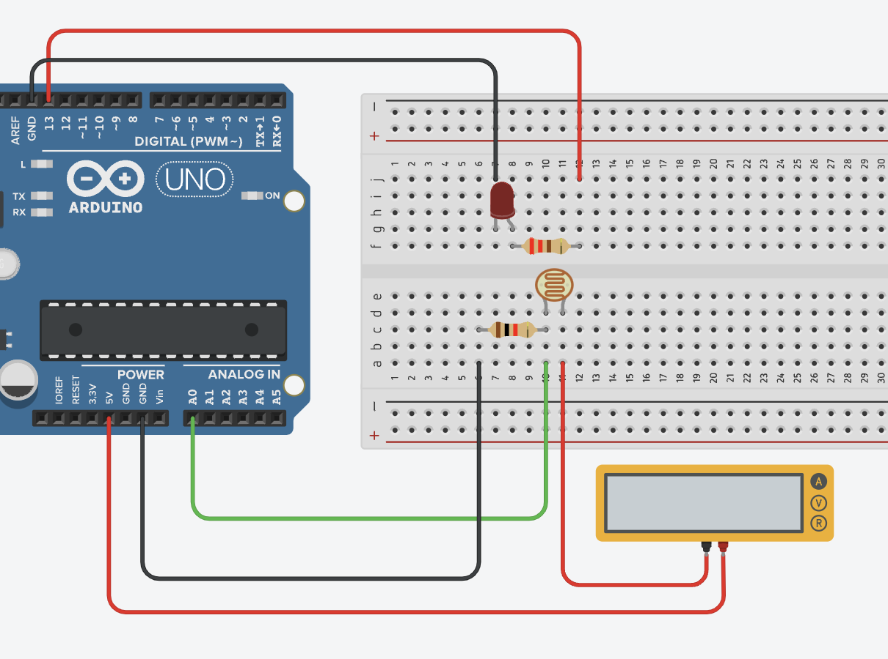

### FINAL PROJECT for General Physics 2 | Do Your Own Experiment (DYOE) 

### Topic: Photoresistors

Download the paper here:
https://github.com/user-attachments/files/17968227/dyoe.pdf

# Shedding Light on Light Dependent Resistors: An Experiment on the Effects of Luminosity on Photoresistor Behavior

**Abstract:**
Light Dependent Resistors (LDR), also referred to as photoresistors, are
light-sensitive passive electronic components that possess varied resistance based on the
intensity of incident light. This behavior makes photoresistors convenient for detecting
the presence or absence of light, and may also be used to measure light intensity. The
experiment’s primary objective is to investigate the relationship between light intensity
and photoresistor resistance. The experiment also aims to validate the expected behavior
of photoresistors by comparing the experimental results with established knowledge and
to explore the applications of photoresistors in different fields. This experiment comprises
two parts. The first part was designed to focus on analyzing the relationship between light
intensity and photoresistor resistance. This part involved measuring five different levels of
luminosity from a light source and exposing a photoresistor to these different luminous
levels. A multimeter was used to measure the current passing through the photoresistor as
it was subjected to different luminous intensities. The second part involved utilizing an
Arduino microcontroller to simulate an application of photoresistors by turning on a
light-emitting diode (LED) in the case that light is obstructed from the photoresistor. The
results gathered from this experiment were consistent with the expected behavior of
photoresistors in which resistance increased as a result of decreasing luminosity. Such a
simple component is relied upon by many different applications in varying fields.
Photoresistors are found in automobiles, security systems, medical devices, and consumer
electronics. The experimental results provided key insights into the behavior of
photoresistors as a result of exposure to different light intensities. This experiment also
verified the established principles of photoresistor behavior as well as its numerous
applications, gaining a deeper appreciation and understanding of this technology.

**Key Words:** Photoresistors; Light sensing; Arduino; Ohm’s law; Electronics

## Circuit Diagram

## Images of the Experiment

